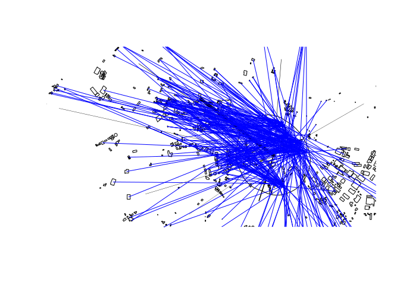
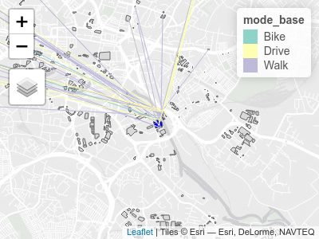

<!-- README.md is generated from README.Rmd. Please edit that file -->

# abstr

<!-- badges: start -->

[](https://github.com/a-b-street/abstr/actions)
<!-- badges: end -->

The goal of abstr is to provide an R interface to the [A/B
Street](https://github.com/a-b-street/abstreet#ab-street) transport
planning/simulation game. Currently it provides a way to convert
aggregated origin-destination data, combined with data on buildings
representing origin and destination locations, into `.json` files that
can be directly imported into the A/B Street game. See
<https://a-b-street.github.io/docs/dev/formats/scenarios.html#example>
for details of the schema that the package outputs.

## Installation

You can install the released version of abstr from
<!-- [CRAN](https://CRAN.R-project.org) with: --> GitHub as follows:

``` r
remotes::install_github("a-b-street/abstr")
```

## Example

The example below shows how `abstr` can be used. The input datasets
include `sf` objects representing houses, buildings, origin-destination
(OD) data represented as desire lines and administrative zones
representing the areas within which trips in the desire lines start and
end. With the exception of OD data, each of the input datasets is
readily available for most cities. The input datasets are illustrated in
the plots below, which show example data shipped in the package, taken
from the city of Leeds, UK.

``` r
library(abstr)
library(tmap) # for map making
tm_shape(leeds_zones) + tm_polygons(col = "grey") +
  tm_shape(leeds_site_area) + tm_polygons(col = "red") +
  tm_shape(leeds_houses) + tm_polygons(col = "yellow") +
  tm_shape(leeds_buildings) + tm_polygons(col = "blue") +
  tm_shape(leeds_desire_lines) + tm_lines(lwd = "all_base", scale = 3)
#> Linking to GEOS 3.8.0, GDAL 3.0.4, PROJ 7.0.0
```

<div class="figure">


<p class="caption">
Example data that can be used as an input by functions in abstr to
generate trip-level scenarios that can be imported by A/B Street.
</p>

</div>

``` r
ablines = ab_scenario(
 houses = leeds_houses,
 buildings = leeds_buildings,
 desire_lines = leeds_desire_lines,
 zones = leeds_zones,
 output_format = "sf"
)
tmap_mode("view")
bb = tmaptools::bb(leeds_houses, 10)
tm_shape(leeds_buildings, bbox = bb) + tm_polygons() +
  tm_shape(leeds_houses) + tm_polygons(col = "blue") +
  tm_shape(ablines) + tm_lines(col = "mode_base") 
```



Each line in the plot above represents a single trip, color representing
mode. Each trip has an associated departure time, that can be
represented in A/B Street.

Under a different scenario, the Go Dutch scenario of active travel
uptake represented in the columns containing `godutch` for example, the
travel patterns would be substantially different. In the aggregated
desire lines, the differences between the two scenarios are substantial,
as shown in the table below:

``` r
desire_line_data = sf::st_drop_geometry(leeds_desire_lines)
nms = names(desire_line_data)
nms
#>  [1] "geo_code1"     "geo_code2"     "all_base"      "walk_base"    
#>  [5] "cycle_base"    "drive_base"    "length"        "walk_godutch" 
#>  [9] "cycle_godutch" "drive_godutch"
nms_scenarios = nms[grepl(pattern = "base|dutch", x = nms)]
knitr::kable(desire_line_data[nms_scenarios])
```

| all\_base | walk\_base | cycle\_base | drive\_base | walk\_godutch | cycle\_godutch | drive\_godutch |
|----------:|-----------:|------------:|------------:|--------------:|---------------:|---------------:|
|        16 |         12 |           1 |           3 |            13 |              3 |              0 |
|        11 |          6 |           0 |           5 |             8 |              3 |              0 |
|        10 |          5 |           1 |           4 |             6 |              3 |              1 |

The Go Dutch scenario can be disaggregated so that trips start and begin
in buildings, as shown below.

``` r
ablines_dutch = ab_scenario(
 houses = leeds_houses,
 buildings = leeds_buildings,
 desire_lines = leeds_desire_lines,
 zones = leeds_zones,
 output_format = "sf"
)
tm_shape(leeds_buildings, bbox = bb) + tm_polygons() +
  tm_shape(leeds_houses) + tm_polygons(col = "blue") +
  tm_shape(ablines_dutch) + tm_lines(col = "mode_base") 
```



<!-- todo: add time to df -->

You can output the result as a list object that can be saved as a JSON
file as follows, taking only one of the desire lines (desire line 7,
which has only 9 trips for ease of viewing the results) as an example:

``` r
library(abstr)
ab_scenario_list = ab_scenario(
 leeds_houses,
 leeds_buildings,
 leeds_desire_lines,
 leeds_zones,
 output_format = "json_list"
)
ab_scenario_list
#> $scenario_name
#> [1] "base"
#> 
#> $people
#> # A tibble: 37 x 2
#>    origin$Position$longitude $$latitude trips           
#>                        <dbl>      <dbl> <list>          
#>  1                     -1.53       53.8 <tibble [1 × 3]>
#>  2                     -1.53       53.8 <tibble [1 × 3]>
#>  3                     -1.53       53.8 <tibble [1 × 3]>
#>  4                     -1.53       53.8 <tibble [1 × 3]>
#>  5                     -1.53       53.8 <tibble [1 × 3]>
#>  6                     -1.53       53.8 <tibble [1 × 3]>
#>  7                     -1.53       53.8 <tibble [1 × 3]>
#>  8                     -1.53       53.8 <tibble [1 × 3]>
#>  9                     -1.53       53.8 <tibble [1 × 3]>
#> 10                     -1.53       53.8 <tibble [1 × 3]>
#> # … with 27 more rows
ab_save(ab_scenario_list, "ab_scenario.json")
```

Let’s see what is in the file:

``` r
file.edit("ab_scenario.json")
```

The first trip schedule should look something like this, matching [A/B
Street’s
schema](https://a-b-street.github.io/docs/dev/formats/scenarios.html#example).

``` json
{
  "scenario_name": "base",
  "people": [
    {
      "origin": {
        "Position": {
          "longitude": -1.5278,
          "latitude": 53.7888
        }
      },
      "trips": [
        {
          "departure": 28236,
          "destination": {
            "Position": {
              "longitude": -1.5717,
              "latitude": 53.8039
            }
          },
          "mode": "Walk"
        }
      ]
    }
```
