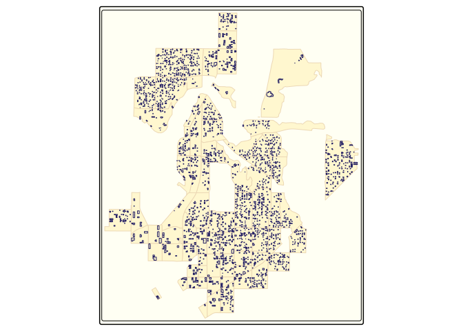
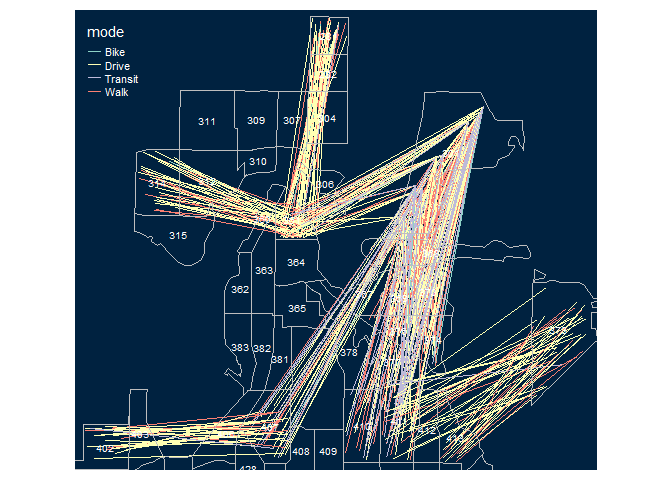

<!-- README.md is generated from README.Rmd. Please edit that file -->

# abstr

<!-- badges: start -->

[](https://github.com/a-b-street/abstr/actions)
<!-- badges: end -->

The goal of abstr is to provide an R interface to the [A/B
Street](https://github.com/a-b-street/abstreet#ab-street) transport
planning/simulation game. Currently it provides a way to convert
aggregated origin-destination data, combined with data on buildings
representing origin and destination locations, into `.json` files that
can be directly imported into the A/B Street game. See
<https://a-b-street.github.io/docs/dev/formats/scenarios.html#example>
for details of the schema that the package outputs.

## Installation

You can install the released version of abstr from
<!-- [CRAN](https://CRAN.R-project.org) with: --> GitHub as follows:

``` r
remotes::install_github("a-b-street/abstr")
```

## Example

The example below shows how `abstr` can be used. The input datasets
include `sf` objects representing buildings, origin-destination (OD)
data represented as desire lines and administrative zones representing
the areas within which trips in the desire lines start and end. With the
exception of OD data, each of the input datasets is readily available
for most cities. The input datasets are illustrated in the plots below,
which show example data shipped in the package, taken from the Seattle,
U.S.

``` r
library(abstr)
library(tmap) # for map making
#> Warning: package 'tmap' was built under R version 4.0.5
tm_shape(montlake_zones) + tm_polygons(col = "grey") +
  tm_shape(montlake_buildings) + tm_polygons(col = "blue")
```

<div class="figure">


<p class="caption">
Example data that can be used as an input by functions in abstr to
generate trip-level scenarios that can be imported by A/B Street.
</p>

</div>

The map above is a graphical representation of the Montlake residential
neighborhood in central Seattle, Washington. Here, `montlake_zones`
represents neighborhood residential zones declared by Seattle local
government and `montlake_buildings` being the accumulation of buildings
listed in
<a link href="https://www.openstreetmap.org/#map=5/54.910/-3.432">
OpenStreetMap</a>

The final piece of the `abstr` puzzle is OD data.

``` r
head(montlake_od)
#> # A tibble: 6 x 6
#>    o_id  d_id Drive Transit  Bike  Walk
#>   <dbl> <dbl> <int>   <int> <int> <int>
#> 1   281   361    23       1     2    14
#> 2   282   361    37       4     0    11
#> 3   282   369    14       3     0     8
#> 4   301   361    27       4     3    15
#> 5   301   368     6       2     1    16
#> 6   301   369    14       2     0    13
```

In this example, the first two columns correspond to the origin and
destination zones in Montlake, with the subsequent columns representing
the transport mode share between these zones.

Let’s combine each of the elements outlined above, the zone, building
and OD data. We do this using the `ab_scenario()` function in the
`abstr` package, which generates a data frame representing tavel between
the `montlake_buildings`:

``` r
output_sf = ab_scenario(
  od = montlake_od,
  zones = montlake_zones,
  zones_d = NULL,
  origin_buildings = montlake_buildings,
  destination_buildings = montlake_buildings,
  pop_var = 3,
  time_fun = ab_time_normal,
  output = "sf",
  modes = c("Walk", "Bike", "Drive", "Transit")
)
```

The `output_sf` object created above can be further transformed to match
[A/B Street’s
schema](https://a-b-street.github.io/docs/tech/dev/formats/scenarios.html)
and visualised in A/B Street, or visualised in R (using the `tmap`
package in the code chunk below):

``` r
tmap::tm_shape(output_sf) + tmap::tm_lines(col = "mode") +
  tmap::tm_shape(montlake_zones) + tmap::tm_borders()
```



Each line in the plot above represents a single trip, with the color
representing each transport mode. Moreover, each trip is configured with
an associated departure time, that can be represented in A/B Street.

The `ab_save` and `ab_json` functions conclude the `abstr` workflow by
outputting a local JSON file, matching the [A/B Street’s
schema](https://a-b-street.github.io/docs/tech/dev/formats/scenarios.html).

``` r
ab_save(ab_json(output_sf, time_fun = ab_time_normal,
                scenario_name = "Montlake Example"),
        f = "montlake_scenarios.json")
```

Let’s see what is in the file:

``` r
file.edit("ab_scenario.json")
```

The first trip schedule should look something like this, matching [A/B
Street’s
schema](https://a-b-street.github.io/docs/dev/formats/scenarios.html#example).

``` json
{
  "scenario_name": "Montlake Example",
  "people": [
    {
      "trips": [
        {
          "departure": 317760000,
          "origin": {
            "Position": {
              "longitude": -122.3139,
              "latitude": 47.667
            }
          },
          "destination": {
            "Position": {
              "longitude": -122.3187,
              "latitude": 47.6484
            }
          },
          "mode": "Walk",
          "purpose": "Shopping"
        }
      ]
    }
```

## Next steps

For a more comprehensive guide in the art of collecting, transforming
and saving data for A/B Street, check out the numerous `abstr`
[vignette’s](https://a-b-street.github.io/abstr/).
