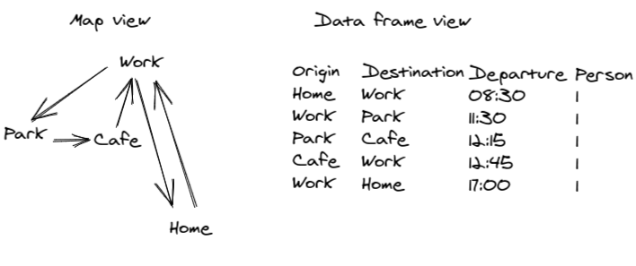

```{r, include = FALSE}
knitr::opts_chunk$set(
  collapse = TRUE,
  comment = "#>"
)
```

# Introduction

Simple representations of transport systems based on origin-destination data often represent daily travel patterns as a single main trip per day, without distinguishing between multiple stages in a multi-stage trip (walk -> bus -> walk -> destination trips are simply represented as bus -> destination) or even multiple trips during the course of the day (omitting the fact that many people take a lunchtime trip to get lunch or simply to stretch their legs each day).

The concept of an 'activity model' aims to address these limitations by representing the complete list of activities undertaken by people throughout the day in the activity model.
In this sense A/B Street can be seen as an activity model.

To show how A/B Street represents activity model data, we will take a hypothetical example, a trip from home to work and then to the park, to lunch and then to work before returning home after work.
This 5 trip activity is more realistic that simple OD based models that just represents people travelling from home to work (and not back again in many cases), and is illustrated in the figure below.




How to get this information into a format for modelling?
This article demonstrates how the data can be represented in R with the `abstr` package, and then converted into a format that can be imported by A/B Street.

```{r setup}
library(abstr)
```

# Minimal example

In R code, the minimal example shown above can be represented as follows:


```{r getlocations, eval=FALSE, echo=FALSE}
home = stplanr::geo_code("potternewton park")
work = stplanr::geo_code("university of leeds")
park = stplanr::geo_code("woodhouse moore park")
cafe = stplanr::geo_code("heart centre leeds")
cafe = stplanr::geo_code("worsley building leeds")
```


```{r places}
places = tibble::tribble(
  ~name, ~x, ~y,
  "Home", -1.524, 53.819,
  "Work", -1.552, 53.807,
  "Park", -1.560, 53.812,
  "Cafe", -1.556, 53.802
)
places_sf = sf::st_as_sf(places, coords = c("x", "y"), crs = 4326)
plot(places_sf, pch = places$name)
# mapview::mapview(places_sf, pch = places$name)
```


```{r placestoosimple, eval=FALSE, echo=FALSE}
places = tibble::tribble(
  ~name, ~x, ~y,
  "Home", 5, 0,
  "Work", 2, 5,
  "Park", 1, 4,
  "Cafe", 2, 4
)
places_sf = sf::st_as_sf(places, coords = c("x", "y"))
plot(places_sf, pch = places$name)
```


```{r lines}
od = tibble::tribble(
  ~o, ~d, ~mode, ~departure, ~person,
  "Home", "Work", "Bike", "08:30", 1,
  "Work", "Park", "Walk", "11:30", 1,
  "Park", "Cafe", "Walk", "12:15", 1,
  "Cafe", "Work", "Walk", "12:45", 1,
  "Work", "Home", "Bike", "17:00", 1
)
od_sf = od::od_to_sf(od, places_sf)
plot(od_sf["departure"], reset = FALSE, key.pos = 1, lwd = 6:2)
plot(places_sf$geometry, pch = places$name, add = TRUE, cex =2)
# mapview::mapview(od_sf["departure"])
```

```{r, eval=FALSE}
od::od_coordinates(od_sf)
```


```{r}
departure_times = c(
  8.5,
  11.5,
  12.25,
  12.75,
  17
)
od_sf$departure = ab_time_normal(hr = departure_times, sd = 0.15, n = length(departure_times))
od_json1 = ab_json(desire_lines_out = od_sf[1, ], scenario_name = "activity")
od_json2 = ab_json(desire_lines_out = od_sf[1:2, ], scenario_name = "activity")
od_json = ab_json(desire_lines_out = od_sf, scenario_name = "activity")
```

```{r, results='asis'}
ab_save(od_json1, f = "scenario1.json")
# readChar("scenario1.json", nchars = 1e9)
# file.edit("scenario1.json")
```

That results in the following file:

```json
{
  "scenario_name": "activity",
  "people": [
    {
      "trips": [
        {
          "departure": 30856,
          "origin": {
            "Position": {
              "longitude": -1.524,
              "latitude": 53.819
            }
          },
          "destination": {
            "Position": {
              "longitude": -1.552,
              "latitude": 53.807
            }
          },
          "mode": "Bike",
          "purpose": "Work"
        }
      ]
    }
  ]
}

```

What do the first 2 trips look like?

```{r}
ab_save(od_json2, "scenario2.json")
# file.edit("scenario2.json")
```
